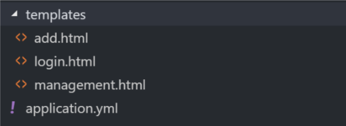
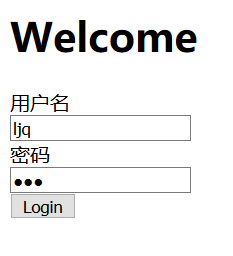
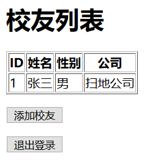
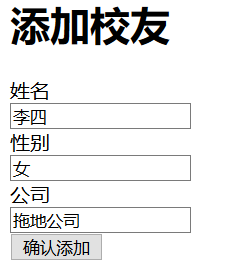
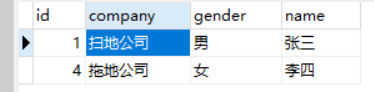
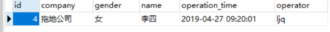
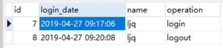

#  <center>实验二：EJB调用和练习
## 实验环境
    操作系统：windows10 pro
    编译器：  IDEA intellij
    数据库：  MySQL
### 1、实验目的
    熟悉spring或者spring boot基于MVC的编程；
### 2、实验内容
- 利用Spring技术实现【实验二】中的校友信息网站。要求采用MVC框架，同时要求加入面向切面的编程。
- 构建一个安全验证的切面。要求：
1. 对于所有的Alumni表的查询操作，验证用户已经登录；如果用户没有登录，先导航到登录页面；
2. 对于所有的Alumni表的更新（更新和删除）操作，在Read权限的基础上验证用户具有Update的权限。如果没有，该操作取消，并导航到错误页面。
3. 对于所有的Alumni表的汇总和下载操作，验证用户具有Aggregate权限；如果没有，该操作取消，并导航到错误页面。
### 3、实验知识点
- 3.1 什么是 AOP?
    <br>AOP为Aspect Oriented Programming的缩写，意为：面向切面编程，通过预编译方式和运行期动态代理实现程序功能的统一维护的一种技术。AOP是OOP的延续，是软件开发中的一个热点，也是Spring框架中的一个重要内容，是函数式编程的一种衍生范型。利用AOP可以对业务逻辑的各个部分进行隔离，从而使得业务逻辑各部分之间的耦合度降低，提高程序的可重用性，同时提高了开发的效率。
    
- 3.2 AOP 相关概念
    <br>切面（Aspect）    
    横切关注点的模块化（跨越应用程序多个模块的功能，比如 日志功能），这个关注点实现可能另外横切多个对象。    
    <br>连接点（Join point）   
    连接点是在应用执行过程中能够插入切面的一个点。这个点可以是类的某个方法调用前、调用后、方法抛出异常后等。切面代码可以利用这些点插入到应用的正常流程之中，并添加行为。    
    <br>通知（Advice）     
    在特定的连接点，AOP框架执行的动作。    
    Spring AOP 提供了5种类型的通知：    
    前置通知（Before）：在目标方法被调用之前调用通知功能。    
    后置通知（After）：在目标方法完成之后调用通知，无论该方法是否发生异常。    
    后置返回通知（After-returning）：在目标方法成功执行之后调用通知。    
    后置异常通知（After-throwing）：在目标方法抛出异常后调用通知。    
    环绕通知（Around）：通知包裹了被通知的方法，在被通知的方法调用之前和调用之后执行自定义的行为。      
    <br>切点（Pointcut）    
    指定一个通知将被引发的一系列连接点的集合。AOP 通过切点定位到特定的连接点。切点和连接点不是一对一的关系，一个切点匹配多个连接点，切点通过 org.springframework.aop.Pointcut 接口进行描述，它使用类和方法作为连接点的查询条件。每个类都拥有多个连接点，例如 ArithmethicCalculator类的所有方法实际上都是连接点。    
    <br>引入（Introduction）    
    添加方法或字段到被通知的类。 Spring允许引入新的接口到任何被通知的对象。例如，你可以使用一个引入使任何对象实现 IsModified接口，来简化缓存。Spring中要使用Introduction, 可有通过DelegatingIntroductionInterceptor来实现通知，通过DefaultIntroductionAdvisor来配置Advice和代理类要实现的接口。    
    <br>目标对象（Target Object）    
    包含连接点的对象。也被称作被通知或被代理对象。    
    AOP代理（AOP Proxy）    
    AOP框架创建的对象，包含通知。 在Spring中，AOP代理可以是JDK动态代理或者CGLIB代理。    
    <br>织入(Weaving)    
    织入描述的是把切面应用到目标对象来创建新的代理对象的过程。 Spring AOP 的切面是在运行时被织入，原理是使用了动态代理技术。Spring支持两种方式生成代理对象：JDK动态代理和CGLib，默认的策略是如果目标类是接口，则使用JDK动态代理技术，否则使用Cglib来生成代理。

### 4、实验设计与实现过程

- 4.1 view层设计

    

- 4.2 model层设计    
    导入依赖和配置数据库连接
    ```yaml
    spring:

    datasource:
        driverClassName: com.mysql.cj.jdbc.Driver
        url: jdbc:mysql://127.0.0.1:3306/java?useUnicode=true&characterEncoding=UTF-8&useSSL=false&serverTimezone=GMT&zeroDateTimeBehavior=CONVERT_TO_NULL
        username: root
        password: mysql
    mvc:
        view:
        prefix: /WEB-INF/views/
        suffix: .jsp
    jpa:
        hibernate:
        ddl-auto: update
        show-sql: true
    ```

    编写entity类(例Admin.java)
    ```java
    package lin.mvc.entity;

    import javax.persistence.*;
    import java.util.Date;

    @Entity(name = "admin")
    @Table(indexes = {
            @Index(name = "id", columnList = "id", unique = true), //
            @Index(name = "name", columnList = "name", unique = true)
    })

    public class Admin {
        @Id
        @GeneratedValue
        @Column(length = 20)
        private Long id;

        @Column(length = 100, nullable = false)
        private String name;

        @Column(length = 100, nullable = false)
        private String password;

        @Temporal(TemporalType.TIMESTAMP)
        @Column(nullable = false)
        private Date loginDate;

        @Column(length = 3)
        private Integer lastTime;

        @Column(length = 3)
        private Integer loginCount;

        public String getName() {
            return name;
        }

        public Long getId() {
            return id;
        }

        public void setId(Long id) {
            this.id = id;
        }

        public void setName(String name) {
            this.name = name;
        }

        public String getPassword() {
            return password;
        }

        public void setPassword(String password) {
            this.password = password;
        }

        public Date getLoginDate() {
            return loginDate;
        }

        public void setLoginDate(Date loginDate) {
            this.loginDate = loginDate;
        }

        public Integer getLastTime() {
            return lastTime;
        }

        public void setLastTime(Integer lastTime) {
            this.lastTime = lastTime;
        }

        public Integer getLoginCount() {
            return loginCount;
        }

        public void setLoginCount(Integer loginCount) {
            this.loginCount = loginCount;
        }
    }

    ```


    编写Repository接口(例AdminRepository.java)
    ```
    package lin.mvc.repository;

    import lin.mvc.entity.Admin;
    import org.springframework.data.jpa.repository.JpaRepository;

    import java.util.List;

    public interface AdminRepository extends JpaRepository<Admin, Long> {

        public Admin findOneByNameAndPassword(String name, String password);

    }
    ```

- 4.3 controller层设计(例AddController)
    ```java
    package lin.mvc.controller;

    import lin.mvc.entity.User;
    import lin.mvc.repository.InsertLogRepository;
    import lin.mvc.repository.UserRepository;
    import org.springframework.beans.factory.annotation.Autowired;
    import org.springframework.ui.Model;
    import org.springframework.web.bind.annotation.RequestMapping;
    import org.springframework.web.bind.annotation.RequestMethod;
    import org.springframework.web.bind.annotation.RequestParam;

    import java.util.Map;

    @org.springframework.stereotype.Controller
    public class AddController {

        @Autowired
        private UserRepository userRepository;

        @RequestMapping(value = {"/add"})
        public String addView(Map<String, Object> map) {
            return "add";
        }

        @RequestMapping(value = "/Add", method = RequestMethod.POST)
        public String insert(Model model, @RequestParam("textName") String name, @RequestParam("textGender") String gender, @RequestParam("textCompany") String company) {

            User user= new User();
            user.setName(name);
            user.setGender(gender);
            user.setCompany(company);

            userRepository.save(user);

            model.addAttribute("userList", userRepository.findAll());
            return "management";
        }

    }

    ```
- 4.4 切片设计
    ```java
    package lin.mvc.monitor;

    import lin.mvc.entity.InsertLog;
    import lin.mvc.entity.UserLog;
    import lin.mvc.repository.InsertLogRepository;
    import lin.mvc.repository.UserLogRepository;
    import org.aspectj.lang.JoinPoint;
    import org.aspectj.lang.annotation.After;
    import org.aspectj.lang.annotation.Aspect;
    import org.aspectj.lang.annotation.Before;
    import org.springframework.beans.factory.annotation.Autowired;
    import org.springframework.stereotype.Component;
    import org.springframework.web.context.request.RequestContextHolder;
    import org.springframework.web.context.request.ServletRequestAttributes;

    import javax.servlet.http.HttpServletRequest;
    import javax.servlet.http.HttpSession;
    import java.util.Date;

    @Aspect
    @Component
    public class LogMonitor {

        @Autowired
        private UserLogRepository userLogRepository;

        @Autowired
        private InsertLogRepository insertLogRepository;

        @After("execution(public * lin.mvc.controller.*.login(..))")
        public void loginServiceAccess(JoinPoint joinPoint)
        {
            HttpSession session= ((ServletRequestAttributes) RequestContextHolder.getRequestAttributes()).getRequest().getSession();
            String s = String.valueOf(session.getAttribute("name"));
            if(!s.equals("null"))
            {
                UserLog userLog = new UserLog();
                userLog.setName(s);
                userLog.setLoginDate(new Date());
                userLog.setOperation("login");
                userLogRepository.save(userLog);
            }
        }

        @Before("execution(public * lin.mvc.controller.*.logout(..))")
        public void logoutServiceAccess(JoinPoint joinPoint)
        {
            HttpSession session= ((ServletRequestAttributes) RequestContextHolder.getRequestAttributes()).getRequest().getSession();
            String s = String.valueOf(session.getAttribute("name"));
            if(!s.equals("null"))
            {
                UserLog userLog = new UserLog();
                userLog.setName(s);
                userLog.setLoginDate(new Date());
                userLog.setOperation("logout");
                userLogRepository.save(userLog);
            }
        }

        @After("execution(public * lin.mvc.controller.*.insert(..))")
        public void insertServiceAccess(JoinPoint joinPoint)
        {
            HttpServletRequest request= ((ServletRequestAttributes) RequestContextHolder.getRequestAttributes()).getRequest();
            HttpSession session= request.getSession();

            InsertLog insertLog = new InsertLog();
            insertLog.setOperator(String.valueOf(session.getAttribute("name")));
            insertLog.setOperationTime(new Date());
            insertLog.setName(request.getParameter("textName"));
            insertLog.setGender(request.getParameter("textGender"));
            insertLog.setCompany(request.getParameter("textCompany"));

            insertLogRepository.save(insertLog);
        }
    }


    ```

### 5、实验结果截图

用户登录



管理校友



添加校友



成功插入新数据(数据库)



插入日志记录(数据库)



登陆出记录(数据库)



