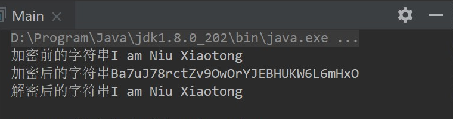

#  <center>实验三：COM组件和调用
## 实验环境
- 操作系统：windows 10 pro
- IDE：Visual Studio 2017; IDEA intellij 
### 1、实验目的
- 利用c#生成一个com组件，并利用java调用概组件
### 2、实验内容
- 构建一个com组件，该组件可以对一个字符串数组进行加密和解密；（加/解密算法自己定义，或者调用调用其他的库）
### 3、实验知识点
- 3.1 什么是 COM 组件？
    <br>COM是Component Object Model（组件对象模型）的缩写。COM组件是以WIN32动态链接库（DLL）或可执行文件（EXE）形式发布的可执行代码组成
- 3.2 什么是 GUID？
    <br>globally unique identifier（全球唯一标识符），是分配给COM对象的标识符（ID）。<br>它通过一种复杂的算法生成，该算法保证所有的COM对象都有着唯一的ID，而不会出现名字冲突。
- 3.3 COM 组件编程
    <br>组件：组件实际上是一些可以执行的二进制代码，表现形式可以是dll，也可以使exe。
    <br>组件特点：1.二进制代码，可以执行 2.使用灵活方便  3.和编程语言无关
    <br>组件的标准：COM提供了组件编写的标准，任何语言编写组件时，都要遵循这个标准。
    <br>组件接口：向外对使用者提供组件的功能。

### 4、实验设计与实现过程
- 4.1 利用c#生成一个com组件
    #### IMyClass 接口
    ```c#
        [Guid("83B046BF-5FFC-4B61-9794-3DAE3F9D2599")]
        public interface IMyClass
        {
            string EncryptDES(string str, string key); //DES加密
            string DecryptDES(string str, string key); //DES解密
        }
    ```
    #### ComCryption 接口实现
    ```c#
    [ClassInterface(ClassInterfaceType.None)]
    [Guid("124D6645-6B41-4C50-9939-BBBE149C1F65")]
    [ProgId("ComCryption.Application")]
    public class ComCryption : IMyClass
    {
        /*
         * DES加密功能
         * <param name="strToEncrypt">要加密的字符串</param>
         * <param name="strKey">密钥，必须为8位</param>
         * <returns>以Base64格式返回的加密字符串</returns>
         */
        public string EncryptDES(string strToEncrypt, string strKey)
        {
            using (DESCryptoServiceProvider des = new DESCryptoServiceProvider())
            {
                byte[] inputByteArray = Encoding.UTF8.GetBytes(strToEncrypt);
                des.Key = ASCIIEncoding.ASCII.GetBytes(strKey);
                des.IV = ASCIIEncoding.ASCII.GetBytes(strKey);
                System.IO.MemoryStream ms = new System.IO.MemoryStream();
                using (CryptoStream cs = new CryptoStream(ms, des.CreateEncryptor(), CryptoStreamMode.Write))
                {
                    cs.Write(inputByteArray, 0, inputByteArray.Length);
                    cs.FlushFinalBlock();
                    cs.Close();
                }
                string str = Convert.ToBase64String(ms.ToArray());
                ms.Close();
                return str;
            }
        }
        /*
         * DES解密功能
         * <param name="strToDecrypt">要解密的字符串</param>
         * <param name="strKey">密钥，必须为8位</param>
         * <returns>以Base64格式返回的加密字符串</returns>
         */
        public string DecryptDES(string strToDecrypt, string strKey)
        {
            byte[] inputByteArray = Convert.FromBase64String(strToDecrypt);
            using (DESCryptoServiceProvider des = new DESCryptoServiceProvider())
            {
                des.Key = ASCIIEncoding.ASCII.GetBytes(strKey);
                des.IV = ASCIIEncoding.ASCII.GetBytes(strKey);
                MemoryStream ms = new MemoryStream();
                using (CryptoStream cs = new CryptoStream(ms, des.CreateDecryptor(), CryptoStreamMode.Write))
                {
                    cs.Write(inputByteArray, 0, inputByteArray.Length);
                    cs.FlushFinalBlock();
                    cs.Close();
                }
                string str = Encoding.UTF8.GetString(ms.ToArray());
                ms.Close();
                return str;
            }
        }

    }
    ```
- 4.2 利用java调用组件
    #### Main 调用
    ```java
    public class Main {
        public static void main(String[] args) {
            try {
                ActiveXComponent dotnetCom = null;
                dotnetCom = new ActiveXComponent("ComCryption.Application");     //需要调用的C#代码中的命名空间名和类名。

                String strKey = "AaBbCcDd";
                String strToEncrypt = "I am Niu Xiaotong";
                String strToDecrypt = "";
                String strDecrypted = "";

                System.out.println("加密前的字符串"+strToEncrypt);  //原始的字符串。

                Variant varEn = Dispatch.call(dotnetCom, "EncryptDES", strToEncrypt, strKey);  
                strToDecrypt = varEn.toString();  //返回需要的字符串
                System.out.println("加密后的字符串"+strToDecrypt);  //加密后得到的字符串。

                Variant varDe = Dispatch.call(dotnetCom, "DecryptDES", strToDecrypt, strKey);  
                strDecrypted = varDe.toString();  //返回需要的字符串
                System.out.println("解密后的字符串"+strDecrypted);  //输出解密后的字符串。检查结果是否正确。

            } catch (Exception ex) {
                ex.printStackTrace();
            }
        }
    }
    ```
### 5、实验结果截图
    加密解密输出示例



