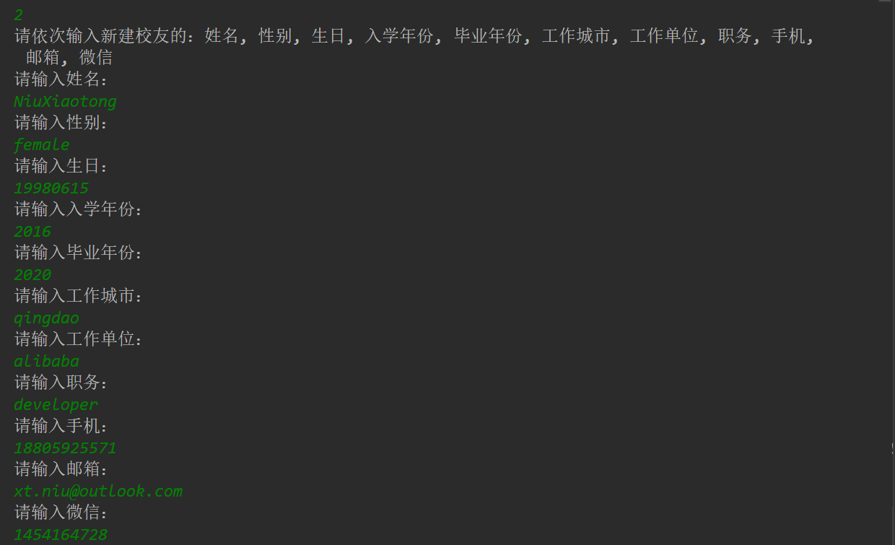

#  <center>实验二：EJB调用和练习
## 实验环境
    操作系统：windows10 pro
    编译器：  IDEA intellij
    服务器：  wildfly
### 1、实验目的
    理解EJB，利用wildfly服务器容器进行远程调用
### 2、实验内容
- 假设某天你毕业了，需要构建一个校友的信息收集系统。 你定义了管理员格Admin表，需要收集的校友的信息Alumni表。Alumni字段定义如下：{姓名、性别、生日、入学年份、毕业年份、工作城市/地区、工作单位、职务、手机、邮箱、微信} 
### 建立无状态的Java Bean，实现以下功能：
- 验证操作用户（录入人员）的登陆的信息是否正确；
- 把校友的数据插入到数据库的中；应包含校友的所有信息；
- 对校友目录进行的检索、修改、删除、统计等功能；
- 随机生成20个录入员，生成1000个校友用户。进行各种增删改的操作。
### 扩展内容【加分 0~5 分】：
- 构建一个校友生成器，生成示例的校友个人信息。甚至使得校友资料达到“以假乱真”的地步。
### 3、实验知识点
- 3.1 什么是 EJB?
    <br>Enterprise Java Bean（EJB）是一种Java EE组件，通常用于在企业应用程序中封装业务逻辑。EJB与Java SE中的简单Java bean不同，开发人员必须明确地实现多线程、并发、事务和安全等概念，应用程序服务器在运行时提供了这些功能，使开发人员可以专注于编写应用程序的业务逻辑。
- 3.2 什么是 Session bean?
    <br>Session Bean为客户端提供接口，并封装可由多个客户端在本地或通过不同协议远程调用的业务逻辑方法。Session EJB可以以客户端透明的方式跨多台机器进行集群和部署。 Java EE标准没有正式定义应该如何聚集EJB的底层细节。 每个应用程序服务器都提供了自己的集群和高可用性机制。 Session bean的接口通常暴露封装应用程序核心业务逻辑的高级API。

- 3.3 什么是 Stateless Session Beans (SLSB)
    <br>SLSB不会在调用之间与客户端保持对话状态。当客户端与Stateless Session Bean进行交互并调用其上的方法时，应用程序服务器将从预先实例化的无状态会话Bean池中分配一个实例。一旦客户端完成调用并断开连接，bean实例将被释放回池中或销毁。
    <br><br>无状态会话bean在应用程序必须为大量客户端同时访问bean的业务方法的情况下非常有用。它们通常可以比有状态会话bean更好地扩展，因为应用程序服务器不必维护状态，并且Bean可以在大型部署中的多台计算机上分布。
    <br><br>无状态会话bean也是将SOAP或REST服务端点公开给Web服务客户端的首选方法。简单的注释被添加到bean类和方法中以实现此功能，而无需编写用于Web服务通信的样板代码。

### 4、实验设计与实现过程
### RemoteAdmin 接口
```java
package org.jboss.as.quickstarts.ejb.remote.stateless;

import java.util.List;

public interface RemoteAdmin {
    void init(); //初始化，创建Admin和Alumni表格,并随机生成数据
    List Login(String sql); //登陆,检测登陆的合法性
    void UpdateAlumni(String sql); //新建,修改,删除校友信息
    List SearchAlumni(String sql); //查询校友信息
}
```
### AdminBean
    调用录入者和校友生成器(RandomUtil)初始化数据库，创建Admin和Alumni表格，并随机生成数据
```java
    @Override
    public void init() {
        RandomUtil randomUtil = new RandomUtil();
        randomUtil.initRandomAdmin(20);
        randomUtil.initRandomAlumni(1000);
    }
```
    登陆功能
```java
    @Override
    public List Login(String sql) {
        List a = new ArrayList();
        try {
            Context context = new InitialContext();
            DataSource dataSource = (DataSource) context.lookup("java:jboss/datasources/ExampleDS");
            Connection connection = dataSource.getConnection();
            Statement statement = connection.createStatement();
            ResultSet resultSet = statement.executeQuery(sql);
            a = convertList(resultSet);
        } catch (SQLException | NamingException e) {
            e.printStackTrace();
        }
        return a;
    }
 ```
    查找校友功能
```JAVA
    @Override
    public List SearchAlumni(String sql) {
        List a = new ArrayList();
        try {
            Context context = new InitialContext();
            DataSource dataSource = (DataSource) context.lookup("java:jboss/datasources/ExampleDS");
            Connection connection = dataSource.getConnection();
            Statement statement = connection.createStatement();
            ResultSet resultSet = statement.executeQuery(sql);
            a = convertList(resultSet);
        } catch (SQLException e) {
            e.printStackTrace();
        } catch (NamingException e) {
            e.printStackTrace();
        }
        return a;
    }
```
    新建/删除/更新校友信息功能
```java
    @Override
    public void UpdateAlumni(String sql) {
        try {
            Context context = new InitialContext();
            DataSource dataSource = (DataSource) context.lookup("java:jboss/datasources/ExampleDS");
            Connection connection = dataSource.getConnection();
            Statement statement = connection.createStatement();
            statement.executeUpdate(sql);
        } catch (SQLException e) {
            e.printStackTrace();
        } catch (NamingException e) {
            e.printStackTrace();
        }
    }
```
### 5、实验结果截图
    登陆界面截图


    随机生成20个录入员，并插入数据库


    [加分项] 随机生成的1000个校友名单，并插入数据库，以假乱真


    查询校友


    新建校友


    新建后查询


    更新校友信息


    更新后查询校友信息


    删除校友信息


    删除后查询校友


    退出

